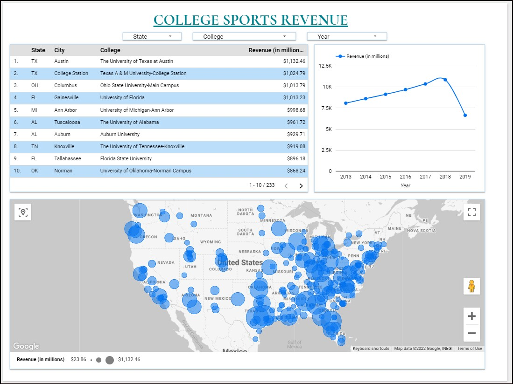
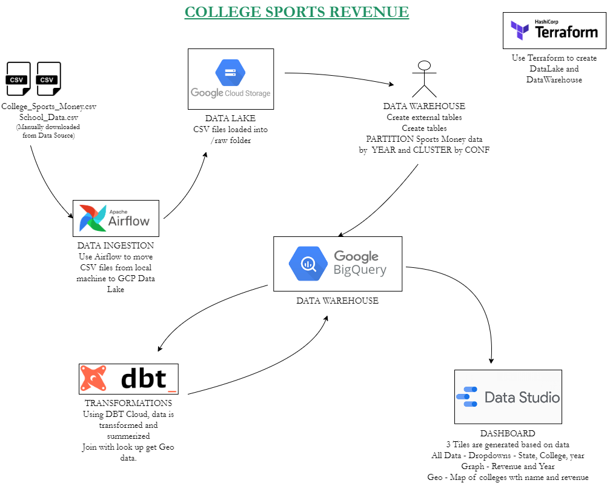

# NCAA and College Sports Revenue

## Project Description
NCAA and other college atheletic events are enormous events in USA. These events show cases great talent, and attract audience via broadcast and in-person. In proportion, it also attracts considerable revenue in various forms. 

Purpose of this project is identify and report amount of sports revenue received over the years by each college. In future releases of the project, a further breakdown and reporting will be provided.

### Hypothetical Requirement - US Dept of Education wants to analyze sports revenue
1. Display list of all colleges and their revenue for the last 5 available years
    1. Include an abilty filter by State, and Year
    2. Include ability to reset (default feature provided by Google Data Studio)

2. Display a graph of total revenue per year
3. Display in a map, locations of colleges and revenue amounts

## Final Dashboard
Final Dashboard - College Sports Revenue 
https://datastudio.google.com/reporting/ce47802e-53fc-40ab-9860-0df04ea52c8b

Sample Screenshot below

### Data Source(s)
US Dept of Education's Equity in Athletics Disclosure Act (EADA) - https://ope.ed.gov/athletics/#/customdata/datafiltered

## Design

## Pipeline
### Set Up
Terraform is used to set up the GCP Storage Bucket and BigQuery

### Data Ingestion
*Rubric - 4 points: End-to-end pipeline: multiple steps in the DAG, uploading data to data lake*

Data (revenue and lookup data) is manually downloaded from data source, due to lack of API. The downloaded data is moved to GCP Cloud Storage Data Lake, using Apache Airflow DAG

*Source*: [NCAA/docker/dags](NCAA/docker/dags)

### Data Warehouse
*Rubric - 4 points: Tables are partitioned and clustered in a way that makes sense for the upstream queries (with explanation)*

Data in GCS is partitioned based on Year and Clustered based on Sports Conference. Partitioning based on year helps in getting data for UI reports Year Filter. Clustering by Sports Conference helps in summarizing amounts by conference.

*Source*: [NCAA/BigQuery/BigQuery.sql](NCAA/BigQuery/BigQuery.sql)

### Transformations (dbt)
*Rubric - 4 points: Tranformations are defined with dbt, Spark or similar technologies*

Using DBT Cloud, data is transformed and summerized - Add all revenue streams, and rolled into Year, College. College names is joined with lookup to get Geo Data.

*Source*: [NCAA_DBT/](NCAA_DBT)

### Dashboard
*Rubric - 4 points: A dashboard with 2 tiles*

3 Tiles are generated in Google Data Studio based on data
* All Data - Dropdowns - State, College, year
* Graph - Revenue and Year
* Geo - Map of colleges with name and revenue

*Report*: https://datastudio.google.com/reporting/ce47802e-53fc-40ab-9860-0df04ea52c8b/page/E52oC

### Reproducibility
*4 points: Instructions are clear, it's easy to run the code, and the code works*

Project and code are thoroughly documented in this README.md.

